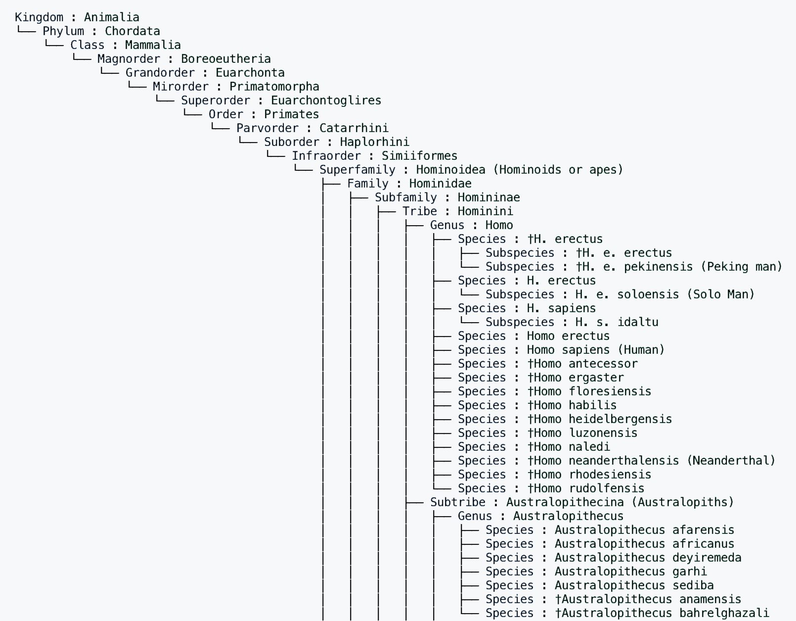

# Taxopedia

Build taxonomic trees (cladograms) from Wikipedia-scraped data.

Example usage:

```python
# scrape the data
TAXA = "Hominidae"
links_dict = search(TAXA, comprehensive=False)

# link the pages
data = linker(TAXA)

# explore the tree
tree = Tree.from_csv(f"{TAXA}.csv")  # load from a slim version
tree.view()
tree.to_csv(f"{TAXA}_full.csv")  # saves a filled in version
```

```txt
Kingdom : Animalia
└── Phylum : Chordata
    └── Class : Mammalia
        └── Magnorder : Boreoeutheria
            └── Grandorder : Euarchonta
                └── Mirorder : Primatomorpha
                    └── Superorder : Euarchontoglires
                        └── Order : Primates
                            └── Parvorder : Catarrhini
                                └── Suborder : Haplorhini
                                    └── Infraorder : Simiiformes
                                        └── Superfamily : Hominoidea (Hominoids or apes)
                                            ├── Family : Hominidae
                                            │   ├── Subfamily : Homininae
                                            │   │   ├── Tribe : Hominini
                                            │   │   │   ├── Genus : Homo
                                            │   │   │   │   ├── Species : †H. erectus
                                            │   │   │   │   │   ├── Subspecies : †H. e. erectus
                                            │   │   │   │   │   └── Subspecies : †H. e. pekinensis (Peking man)
                                            │   │   │   │   ├── Species : H. erectus
                                            │   │   │   │   │   └── Subspecies : H. e. soloensis (Solo Man)
                                            │   │   │   │   ├── Species : H. sapiens
                                            │   │   │   │   │   └── Subspecies : H. s. idaltu
                                            │   │   │   │   ├── Species : Homo erectus
                                            │   │   │   │   ├── Species : Homo sapiens (Human)
                                            │   │   │   │   ├── Species : †Homo antecessor
                                            │   │   │   │   ├── Species : †Homo ergaster
                                            │   │   │   │   ├── Species : †Homo floresiensis
                                            │   │   │   │   ├── Species : †Homo habilis
                                            │   │   │   │   ├── Species : †Homo heidelbergensis
                                            │   │   │   │   ├── Species : †Homo luzonensis
                                            │   │   │   │   ├── Species : †Homo naledi
                                            │   │   │   │   ├── Species : †Homo neanderthalensis (Neanderthal)
                                            │   │   │   │   ├── Species : †Homo rhodesiensis
                                            │   │   │   │   └── Species : †Homo rudolfensis
                                            │   │   │   ├── Subtribe : Australopithecina (Australopiths)
                                            │   │   │   │   ├── Genus : Australopithecus
                                            │   │   │   │   │   ├── Species : Australopithecus afarensis
                                            │   │   │   │   │   ├── Species : Australopithecus africanus
                                            │   │   │   │   │   ├── Species : Australopithecus deyiremeda
                                            │   │   │   │   │   ├── Species : Australopithecus garhi
                                            │   │   │   │   │   ├── Species : Australopithecus sediba
                                            │   │   │   │   │   ├── Species : †Australopithecus anamensis
                                            │   │   │   │   │   └── Species : †Australopithecus bahrelghazali
                                            │   │   │   │   └── Genus : †Paranthropus
                                            │   │   │   │       ├── Species : †P. aethiopicus
                                            │   │   │   │       ├── Species : †P. boisei
                                            │   │   │   │       └── Species : †P. robustus
```

Example Output


