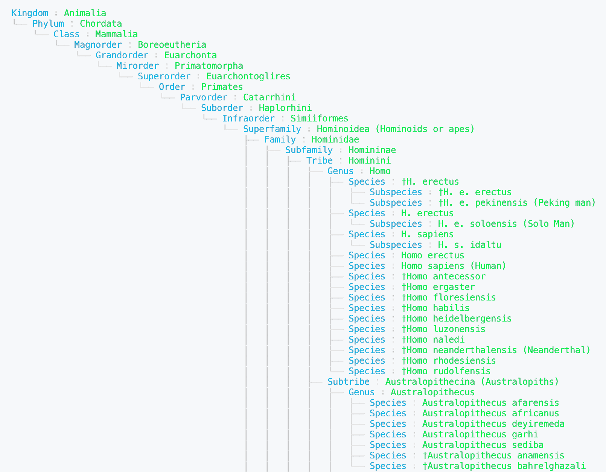

# Taxopedia

Build taxonomic trees (cladograms) from Wikipedia-scraped data.

Example usage:

```python
# scrape the data
TAXA = "Hominidae"
links_dict = search(TAXA, comprehensive=False)

# link the pages
data = linker(TAXA)

# explore the tree
tree = Tree.from_csv(f"{TAXA}.csv")  # load from a slim version
tree.view()
tree.to_csv(f"{TAXA}_full.csv")  # saves a filled in version
```

Example Output


