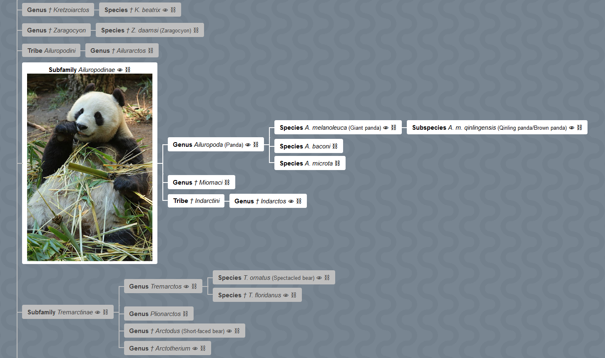

# Taxopedia

Build taxonomic trees (cladograms) from Wikipedia-scraped data.

## Installation

Use the package manager [pip](https://pip.pypa.io/en/stable/) to install
taxopedia.

```bash
pip install taxopedia
```

## Getting Started

```python
import taxopedia

# create a tree... and get a bag of parsed biota boxes!
tree, bag = taxopedia.search("Bears", comprehensive=True)

# pretty print the tree
print(tree.pretty())

# export multiple formats
tree.to_txt("tree_Ursidae.txt")    # plain-text dendrogram
tree.to_html("page_Ursidae.html")  # diagram with images
tree.to_csv("table_Ursidae.csv")   # filled-out tabular data
```

## Tree Manipulation

```py
# take a clone of a tree (to prevent mutation)
cutting = tree.clone()

# finding a node
bears = cutting.find("Ursidae")

# trim cousins (other children of all parents)
bears.exclude_cousins()

# return to the root (topmost parent)
cutting = bears.root()

# re-root the tree
bears = cutting.from_pov("Ursidae")
```

## Saving and Loading Progress

```py
# save the biota bag (so you don't have to scrape it again!)
taxopedia.dump_bag("bag_Ursidae.json", bag)

# loading the biota bag
bag = taxopedia.load_bag("bag_Ursidae.json")

# how to get a tree from a bag
tree = taxopedia.make_tree(bag)
```

## Example Exports

See `docs` folder for raw files.

### Rendered HTML

Click on the image to see a live preview.

[](https://shanedrabing.github.io/taxopedia/page_Ursidae.html)

### Tabular Data

Click on this link to view a CSV output.

[docs/table_Ursidae.csv](docs/table_Ursidae.csv)

### Plain-Text Dendrogram

```txt
Kingdom: Animalia
└── Phylum: Chordata
    └── Class: Mammalia
        └── Order: Carnivora
            └── Suborder: Caniformia (Caniforms)
                └── Infraorder: Arctoidea
                    └── Family: Ursidae (Bears)
                        ├── Genus: Ursus
                        │   ├── Species: U. arctos (Brown bear)
                        │   │   ├── Subspecies: U. a. arctos (Eurasian brown bear)
                        │   │   ├── Subspecies: U. a. arctos / pyrenaicus (Cantabrian brown bear)
                        │   │   ├── Subspecies: U. a. beringianus (Kamchatka brown bear)
                        │   │   ├── Subspecies: U. a. collaris (East Siberian brown bear)
                        │   │   ├── Subspecies: U. a. gobiensis
                        │   │   ├── Subspecies: U. a. horriblis (Grizzly bear)
                        │   │   ├── Subspecies: U. a. isabellinus (Himalayan brown bear)
                        │   │   ├── Subspecies: U. a. lasiotus (Ussuri brown bear)
                        │   │   ├── Subspecies: U. a. marsicanus / arctos (Marsican brown bear)
                        │   │   ├── Subspecies: U. a. middendorffi / horribilis (Kodiak bear, Alaska Peninsula brown bear)
                        │   │   ├── Subspecies: U. a. pruinosus
                        │   │   ├── Subspecies: U. a. stikeenensis (Stickeen brown bear)
                        │   │   ├── Subspecies: U. a. syriacus (Syrian brown bear)
                        │   │   ├── Subspecies: U. a. ungavaesis / horribilis (Ungava brown bear)
                        │   │   ├── Subspecies: † U. a. californicus (California grizzly bear)
                        │   │   ├── Subspecies: † U. a. crowtheri (Atlas bear)
                        │   │   ├── Subspecies: † U. a. horriblis (Mexican grizzly bear)
                        │   │   └── Subspecies: † U. a. priscus
                        │   ├── Species: U. americanus (American black bear)
                        │   │   ├── Subspecies: U. a. carlottae (Haida Gwaii black bear)
                        │   │   ├── Subspecies: U. a. cinnamomum (Cinnamon Bear)
                        │   │   ├── Subspecies: U. a. emmonsii (Glacier bear)
                        │   │   ├── Subspecies: U. a. floridanus (Florida black bear)
                        │   │   ├── Subspecies: U. a. hamiltoni (Newfoundland black bear)
                        │   │   ├── Subspecies: U. a. kermodei (Kermode bear)
                        │   │   └── Subspecies: U. a. luteolus (Louisiana black bear)
                        │   ├── Species: U. thibetanus (Asian black bear)
                        │   │   ├── Subspecies: U. t. formosanus (Formosan black bear)
                        │   │   ├── Subspecies: U. t. gedrosianus (Balochistan black bear)
                        │   │   ├── Subspecies: U. t. japonicus (Japanese bear)
                        │   │   ├── Subspecies: U. t. laniger (Himalayan black bear)
                        │   │   └── Subspecies: U. t. ussuricus (Ussuri black bear)
                        │   ├── Species: U. arctos × U. maritimus
                        │   │   └── Subspecies: U. a. sitkensis (ABC Islands bear)
                        │   ├── Species: U. maritimus (Polar bear)
                        │   │   └── Subspecies: † U. m. tyrannus
                        │   ├── Species: U. deningeri
                        │   ├── Species: U. dolinensis
                        │   ├── Species: U. etruscus
                        │   ├── Species: U. ingressus
                        │   ├── Species: U. minimus
                        │   ├── Species: U. rossicus
                        │   └── Species: † U. spelaeus (Cave bear)
                        ├── Genus: † Kretzoiarctos
                        │   └── Species: † K. beatrix
                        ├── Genus: † Zaragocyon
                        │   └── Species: † Z. daamsi (Zaragocyon)
                        ├── Tribe: Ailuropodini
                        │   └── Genus: † Ailurarctos
                        ├── Subfamily: Ailuropodinae
                        │   ├── Genus: Ailuropoda (Panda)
                        │   │   ├── Species: A. melanoleuca (Giant panda)
                        │   │   │   └── Subspecies: A. m. qinlingensis (Qinling panda/Brown panda)
                        │   │   ├── Species: A. baconi
                        │   │   └── Species: A. microta
                        │   ├── Genus: † Miomaci
                        │   └── Tribe: † Indarctini
                        │       └── Genus: † Indarctos
                        ├── Subfamily: Tremarctinae
                        │   ├── Genus: Tremarctos
                        │   │   ├── Species: T. ornatus (Spectacled bear)
                        │   │   └── Species: † T. floridanus
                        │   ├── Genus: Plionarctos
                        │   ├── Genus: † Arctodus (Short-faced bear)
                        │   └── Genus: † Arctotherium
                        ├── Subfamily: † Hemicyoninae
                        │   ├── Genus: † Cephalogale
                        │   ├── Genus: † Dinocyon
                        │   ├── Genus: † Hemicyon
                        │   ├── Genus: † Phoberocyon
                        │   ├── Genus: † Phoberogale
                        │   └── Genus: † Plithocyon
                        ├── Subfamily: Ursinae
                        │   ├── Genus: Melursus
                        │   │   └── Species: M. ursinus (Sloth bear)
                        │   │       └── Subspecies: M. u. inornatus (Sri Lankan sloth bear)
                        │   └── Genus: Helarctos
                        │       └── Species: H. malayanus (Sun bear)
                        ├── Subfamily: † Ursavinae
                        │   └── Tribe: † Ursavini
                        │       └── Genus: † Ursavus
                        └── Subfamily: † Agriotheriinae
                            └── Genus: † Agriotherium
```

## License

[MIT](https://choosealicense.com/licenses/mit/)
